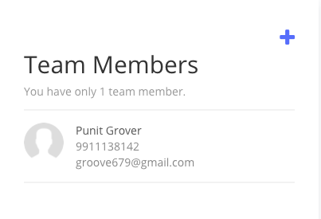
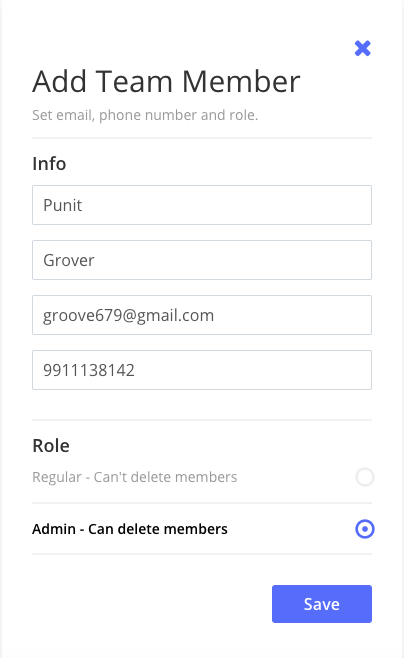
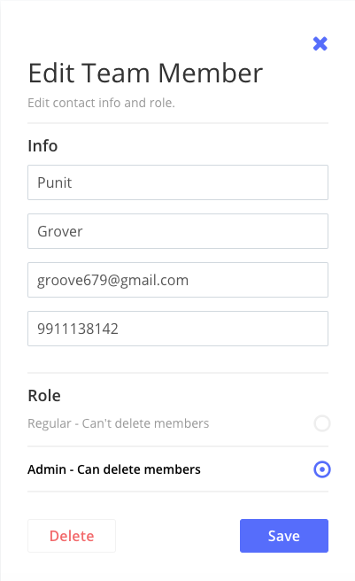

# task-home

## Project Setup
```
git clone git@github.com:PunitGr/task-home.git
cd task-home
```

## Install Dependencies

If you use `yarn` then run `yarn` or for `npm` use `npm install`

## Start dev server
To run it on dev server run `yarn start`. The dev server will be live on [http://localhost:8000/](http://localhost:8000/).

## Screenshot

### List Screen


### Add Screen


### Edit Screen

